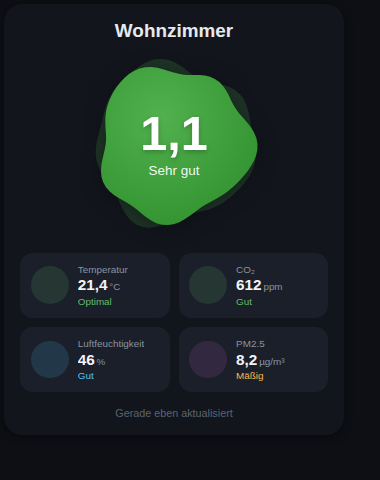

# Air Quality Card

Eine Custom Card für Home Assistant Lovelace, die die Raumluftqualität auf einen Blick zeigt: Gesamtnote (animierter Blob), Temperatur, Luftfeuchtigkeit, CO₂ und PM2.5 – mit farbcodiertem Status pro Metrik.

Ursprünglich als Inline-Dashboard-Ressource entwickelt und mehrfach (pro Raum eine Instanz) im Einsatz (Entwicklungsstufe 1, nie als eigenes Release veröffentlicht). Dieses Repo macht die Karte als eigenständiges HACS-Plugin installier- und versionierbar (Entwicklungsstufe 2 → erstes Release v0.2.0). Die Note wurde bisher von einem separaten UI-Template-Helfer berechnet – dieser wird bei einer HACS-Installation nicht mit übernommen, daher berechnet die Karte die Note selbst (siehe unten).



## Installation

### Über HACS
1. HACS → Frontend → Benutzerdefinierte Repositories → dieses Repo als Kategorie "Dashboard" hinzufügen.
2. "Air Quality Card" installieren.
3. Home Assistant neu laden.

### Manuell
1. `dist/airquality-card.js` nach `www/community/ha-airquality-card/` kopieren.
2. Als Lovelace-Ressource registrieren:
   ```yaml
   url: /hacsfiles/ha-airquality-card/airquality-card.js
   type: module
   ```

## Entwicklung

Die Karte selbst hat weiterhin keinen Build-Schritt (`dist/airquality-card.js` wird direkt bearbeitet und ausgeliefert). Für die Testsuite gibt es eine einzige Dev-Dependency (`jsdom`), die Tests laufen mit Node's eingebautem Test-Runner:

```bash
npm install
npm test
```

Die Tests laden `dist/airquality-card.js` als echtes `<script>` in eine jsdom-Umgebung (genau wie Home Assistant es über die Lovelace-Ressource tut) und decken ab: die Notenberechnung inkl. WHO-Schwellenwerte, den gleitenden PM2.5-Mittelwert (inkl. Caching/Fallback-Verhalten), die Sensor-Plausibilitätsprüfung, das Rendering (Hinweis-/Fehler-/Hauptkartenpfade, Hell/Dunkel/Glass-Darstellung) sowie die Area-Autofill-Logik des Editors (Geräte-Gruppierung, Schlafzimmer-Erkennung, Schutz vor Überschreiben manueller Eingaben).

## Verwendung

Die Karte hat einen visuellen Editor: In Lovelace "Karte hinzufügen" → "Luftqualität Karte" auswählen. Zuerst den **Raum (Area)** auswählen – Name und passende Sensoren (per `device_class` erkannt) werden dann automatisch vorbelegt. Name und jeder einzelne Sensor lassen sich danach jederzeit manuell überschreiben; ein späterer Wechsel der Area überschreibt dann nur noch die Felder, die noch nicht manuell angepasst wurden. Kein YAML nötig. Pro Raum eine eigene Karteninstanz. Die Note wird automatisch aus den vier Sensorwerten berechnet – ein separater Helfer wird nicht benötigt.

Enthält der Raum mehrere Sensoren desselben Typs (z. B. zwei CO₂-Sensoren von zwei unterschiedlichen Geräten), füllt der Editor die Sensor-Felder nur automatisch aus, wenn genau **ein Gerät** im Raum alle vier Sensortypen liefert – dessen Sensoren werden dann komplett übernommen. Gibt es kein solches Gerät (z. B. weil die Sensoren zu unterschiedlichen Geräten gehören), bleiben die Felder leer und müssen manuell zugewiesen werden; der Editor zeigt dazu eine Warnung.

Solange nicht alle Pflichtfelder gesetzt sind, zeigt die Karte einen Hinweis statt eines Fehlers an.

Alternativ per YAML:

```yaml
type: custom:luftqualitaet-card
name: Raum
temp_entity: sensor.raum_temperatur
humidity_entity: sensor.raum_luftfeuchtigkeit
co2_entity: sensor.raum_kohlendioxid
pm25_entity: sensor.raum_pm25
# optional, siehe unten:
weather_entity: weather.forecast_home
temp_target: 21
temp_tolerance: 1
room_max: 22
```

### Konfigurationsoptionen

| Option | Pflicht | Default | Beschreibung |
|---|---|---|---|
| `area_id` | nein | – | Home-Assistant-Raum; befüllt `name` und die Sensor-Felder automatisch vor (nur nicht bereits manuell gesetzte Felder) |
| `name` | nein | "Raum" | Anzeigename des Raums |
| `temp_entity` | ja | – | Temperatursensor |
| `humidity_entity` | ja | – | Luftfeuchtigkeitssensor |
| `co2_entity` | ja | – | CO₂-Sensor (ppm) |
| `pm25_entity` | ja | – | PM2.5-Sensor (µg/m³) |
| `grade_entity` | nein | – | Legacy-Override: Wenn gesetzt, wird die Note direkt aus diesem Sensor gelesen statt lokal berechnet (z. B. für Umstiegsphase vom alten Template-Helfer) |
| `weather_entity` | nein | `weather.forecast_home` | Wetter-Entity für die Außentemperatur-Korrektur der Temperatur-Bewertung |
| `temp_target` | nein | `21` | Ideale Raumtemperatur (°C) für diesen Raum |
| `temp_tolerance` | nein | `1` | Toleranzband (°C) um `temp_target`, innerhalb dessen die Temperatur als optimal gilt |
| `room_max` | nein | `22` | Obergrenze, ab der die Außentemperatur-Korrektur greift |
| `theme_mode` | nein | `auto` | Darstellung: `auto` (folgt der Geräte-/Browser-Einstellung, live), `light` oder `dark` |
| `card_style` | nein | `classic` | Design-Stil der Karte: `classic` (Original-Cyber-Blob), `nordic` (Nordic Minimal), `brutalism` (Neo-Brutalism) oder `editorial` (Minimalist Editorial) |
| `pm25_avg_window` | nein | `1440` (24h) | Zeitfenster (Minuten) für den gleitenden PM2.5-Mittelwert, der in die Note einfließt — Default entspricht dem 24h-Mittelwert der WHO-Guidelines |
| `glass_effect` | nein | `false` | Halbtransparente Glasmorphismus-Optik (Karte + Kacheln) statt deckender Hintergrundfarbe — siehe unten |

Ein Klick auf die Note (nur bei `grade_entity`) oder eine Metrik öffnet den Home-Assistant-Verlauf des jeweiligen Sensors.

### Design-Stile

Seit v0.7.0 kann zwischen vier unterschiedlichen Design-Richtungen gewählt werden:
- **Klassisch (Original)**: Das ursprüngliche, moderne Design mit dem kreisrunden, animierten, leuchtenden Gradient-Blob und Kacheln in einem schlichten Box-Look.
- **Nordic Minimal / Organic**: Ein gemütlicher, skandinavisch inspirierter Look. Er zeichnet sich aus durch eine organisch geschwungene, fließende Blob-Form, Serif-Typografie und Kacheln als weiche, leicht abgesetzte Karten (waldgrüner Dark-Mode, warmer Sand-Ton im Light-Mode).
- **Neo-Brutalism (Retro)**: Ein markanter Vibe mit dicken Konturen (3px), harten Schatten (`box-shadow: 4px 4px 0px`), Monospace-Schrift und kontrastreichen Farb-Pops (im Light-Mode knallige Primärfarben, im Dark-Mode dezentere Töne mit weißem Rahmen).
- **Minimalist Editorial (Paper)**: Ein extrem edler, luftiger Magazin-Look mit hauchdünnen Trennlinien (0.5px), feiner Serif-Typografie und minimalistischen Statuspunkten statt Icons. In Light & Dark (warmer Off-White Papierhintergrund bzw. edles Basalt-Anthrazit).

### Darstellung (Hell/Dunkel)

Die Karte wurde ursprünglich für ein dunkles Design entworfen und bringt seit v0.3.0 zusätzlich ein helles Pendant mit. Im Editor unter "Darstellung" wählbar:
- **Automatisch** (Standard): folgt der Geräte-/Browser-Einstellung (`prefers-color-scheme`), reagiert live auf Änderungen (z. B. wenn das Handy zwischen Tag- und Nachtmodus wechselt).
- **Hell** / **Dunkel**: fest eingestellt, unabhängig vom System.

### Glass-Effekt

Mit `glass_effect: true` wird die Karte halbtransparent mit Weichzeichner (Glasmorphismus) statt einer deckenden Hintergrundfarbe dargestellt — lohnt sich vor allem, wenn das Dashboard ein Hintergrundbild verwendet (z. B. über ein HA-Theme oder eine Hintergrundbild-Karte), da dieses dann durch die Karte hindurchschimmert. Ohne Hintergrundbild bringt der Effekt keinen sichtbaren Mehrwert, daher ist er standardmäßig deaktiviert. Funktioniert in beiden Darstellungsmodi (hell/dunkel).

### Plausibilitätsprüfung

Die Karte prüft `temp_entity`/`humidity_entity`/`co2_entity`/`pm25_entity` auf passende `device_class` bzw. Einheit (°C, %, ppm, µg/m³). Der visuelle Editor zeigt dazu passend nur Sensoren mit der jeweils erwarteten `device_class` zur Auswahl an; im Editor erscheinen zusätzlich Warnungen, falls eine Zuweisung (z. B. über YAML) trotzdem nicht passt. Passt einer dieser vier Sensoren nicht, zeigt die Karte selbst statt einer (dann unsinnigen) Note eine Fehlermeldung mit den betroffenen Entitäten an.

`weather_entity` wird davon bewusst ausgenommen: eine fehlende oder falsche Wetter-Entity blockiert die Karte nicht, da die Notenberechnung dafür automatisch auf Standardwerte zurückfällt (siehe unten) – im Editor erscheint dazu lediglich eine Warnung.

### Notenberechnung

Note 1 (sehr gut) bis 5 (schlecht), gewichtet aus CO₂ (30%), PM2.5 (10%), Luftfeuchtigkeit (30%) und Temperatur (30%), sowie dem jeweils schlechtesten Einzelwert (60% Gewicht auf dem Worst-Case, 40% auf dem gewichteten Durchschnitt). Die Temperaturbewertung erhält zusätzlich einen kleinen Bonus, wenn draußen (laut `weather_entity`) ohnehin kühler/wärmer ist, als tagsüber/nachts drinnen erwartet wird — portiert 1:1 aus dem ursprünglichen Template-Helfer.

Die Default-Werte (`temp_target: 21`, `room_max: 22`) eignen sich für die meisten Wohn-/Arbeitsräume; für Räume mit niedrigerer Zieltemperatur (z. B. Schlafräume) `temp_target`, `temp_tolerance` und `room_max` entsprechend anpassen. Wird per Area-Auswahl ein Raum mit dem Namen "Schlafzimmer"/"Bedroom" erkannt, setzt der Editor `temp_target` automatisch auf 18 °C (siehe Quellen unten) — manuell gesetzte Werte werden dabei nicht überschrieben.

#### Gesundheitliche Grundlage der Schwellenwerte

Die Schwellenwerte pro Metrik orientieren sich an anerkannten Gesundheits-/Baurichtlinien statt an willkürlichen Werten:

- **CO₂** (800 / 1000 / 1400 / 2000 ppm): entspricht den Leitwerten des deutschen Umweltbundesamts (UBA) auf Basis der Pettenkofer-Zahl — <1000 ppm „hygienisch unbedenklich", 1000–2000 ppm „hygienisch auffällig" (Lüftung prüfen), >2000 ppm „hygienisch inakzeptabel". Die WHO definiert für CO₂ selbst keinen Grenzwert, da es in diesen Konzentrationen kein toxikologisches Risiko darstellt, sondern als Lüftungs-Indikator dient.
- **PM2.5** (5 / 15 / 25 / 50 µg/m³): die unteren beiden Stufen entsprechen den **WHO Global Air Quality Guidelines 2021** (Jahresmittel 5 µg/m³, **24h-Mittel 15 µg/m³** — verschärft gegenüber den alten 2005er-Werten 10/25). Der 24h-Mittelwert ist die von der WHO selbst definierte Mittelungsdauer für diesen Wert, daher fließt in die Note standardmäßig ein **gleitender 24h-Mittelwert** (`pm25_avg_window`, Default `1440` Minuten) statt des Momentanwerts ein — kurze Spitzen (Kochen, Kerzen) sollen die Note nicht dominieren, entsprechen aber auch der WHO-Methodik selbst. Die PM2.5-Kachel zeigt als Zahl weiterhin den aktuellen Momentanwert, aber Status/Farbe (Gut/Mäßig/Schlecht) folgen wie die Note demselben 24h-Mittelwert — eine kurzzeitige Spitze (Kochen, Kerzen) färbt die Kachel also nicht mehr "Schlecht", wenn der 24h-Trend tatsächlich unauffällig ist. Kurz nach der Ersteinrichtung (noch keine 24h Verlaufsdaten) kann der genutzte Mittelwert von der finalen 24h-Betrachtung abweichen. Die oberen beiden Stufen (25/50) folgen mangels weiterer WHO-Vorgabe gängigen AQI-Einstufungen (z. B. US EPA).
- **Luftfeuchtigkeit** (Zielwert 50 %, Toleranzbänder bis ±45): die WHO nennt hier bewusst **keinen Zahlenwert** (nur qualitativ: Feuchte/Schimmel vermeiden, da der Zusammenhang nicht präzise quantifizierbar ist), daher folgt die Karte dem breiten Konsens verschiedener Bau-/Komfortstandards (häufig zitierter Zielbereich 30–60 %).
- **Temperatur**: WHO Housing and Health Guidelines (2018) empfehlen **18 °C als gesundheitliches Sicherheitsminimum** für die Allgemeinbevölkerung in genutzten Räumen (kein Risiko nachweisbar im Bereich 18–24 °C bei sitzender Tätigkeit). Das ist kein Schlaf-Komfort-Optimum — daher weicht der automatisch gesetzte Schlafzimmer-Wert (18 °C) bewusst vom Wohnraum-Default (21 °C) ab, ohne dass die Karte eine eigene Schlafforschungs-Empfehlung behauptet.

**Quellen:**
- [UBA – Gesundheitliche Bewertung von Kohlendioxid in der Innenraumluft (PDF)](https://www.umweltbundesamt.de/system/files/medien/pdfs/kohlendioxid_2008.pdf)
- [WHO Global Air Quality Guidelines (Q&A)](https://www.who.int/news-room/questions-and-answers/item/who-global-air-quality-guidelines)
- [WHO Housing and Health Guidelines – Low indoor temperatures (NCBI Bookshelf)](https://www.ncbi.nlm.nih.gov/books/NBK535294/)
- [WHO Housing and Health Guidelines – High indoor temperatures (NCBI Bookshelf)](https://www.ncbi.nlm.nih.gov/books/NBK535285/)
- [WHO Guidelines for Indoor Air Quality – Dampness and Mould (NCBI Bookshelf)](https://www.ncbi.nlm.nih.gov/books/NBK143941/)

## Changelog

### v0.6.0
- 🚀 **Kachel-Animationen & Ambient-Effekte**:
  * **Temperatur-Kachel**: Das Icon und sein kreisförmiger Hintergrund wechseln fließend ihre Farbe – von Eisblau (<= 15°C) über Komfort-Grün (21–22°C) bis Signalrot (>= 27°C). Bei Hover pulsiert das Thermometer-Icon dezent vertikal.
  * **CO₂-Kachel (Ambient-Glow & Molekular-Jitter)**: Bei erhöhten Werten glüht der Hintergrund der Kachel dezent pulsierend (atmender Box-Shadow) in Orange (> 800 ppm) bzw. Rot (> 1400 ppm). Bei Hover fängt das CO₂-Molekül-Icon passend zur Konzentration an zu zittern.
  * **Feinstaub-Partikeleffekt (PM2.5)**: Kleine Staubpartikel schweben im Hintergrund der gesamten PM2.5-Kachel nach oben. Die Anzahl (1–8) und die Aufstiegsgeschwindigkeit passen sich live dem Feinstaub-Messwert an. Bei Hover rotiert das Icon langsam.
  * **Regentropfen-Effekt (Luftfeuchtigkeit)**: Bei Hover fallen zarte, diagonale Regentropfen-Striche durch den Kachelhintergrund. Die Tropfenanzahl skaliert live mit dem Feuchtigkeitswert (von 0 Tropfen bei Trockenheit bis 8 Tropfen bei Nässe).
  * **Barrierefreiheit**: Alle Effekte berücksichtigen die Systemeinstellung `prefers-reduced-motion` und schalten sich bei reduzierter Bewegung ab.

### v0.5.5
- Screenshot der Karte im README ergänzt, GitHub-Topics gesetzt — behebt die fehlschlagenden HACS-Validierungs-Checks „Validation images" und „Validation topics". Keine funktionale Änderung.

### v0.5.4
- 🐛 **Bugfix:** `setConfig()` löste kein Neu-Rendern aus, sondern verließ sich vollständig auf den `hass`-Setter. Lovelace ruft `setConfig()` bei jeder Editor-Änderung auf, setzt `hass` danach aber nicht zuverlässig erneut — und der `hass`-Setter selbst rendert nur bei geänderter Sensor-Signatur neu. Reine Config-Änderungen im visuellen Editor (Darstellungsmodus, Glass-Effekt, PM2.5-Mittelungsfenster, Zieltemperatur, …) blieben dadurch unsichtbar, bis zufällig ein beobachteter Sensor aktualisierte. `setConfig()` rendert jetzt eigenständig neu. 2 neue Regressionstests (73 gesamt).

### v0.5.3
- Testsuite um die bisher ungetestete Editor-Eviction-Logik ergänzt (`value-changed`-Handler, `_autofilledKeys`-State-Machine) — laut Repo-Review der Punkt mit dem höchsten Regressionsrisiko im Repo. 7 neue Tests (71 gesamt), keine funktionale Änderung.

### v0.5.2
- `info.md` (die HACS-Store-Beschreibung vor der Installation) war seit v0.2.x nicht mehr aktualisiert worden und erwähnte weder Darstellungsmodus/Glass-Effekt noch den PM2.5-Mittelwert — jetzt aktuell.
- Cache-Refresh-Intervall des PM2.5-Mittelwerts skaliert jetzt mit der Fensterlänge (5–60 Minuten statt fest 5 Minuten) — verhindert, dass ein häufig aktualisierender ("chatty") PM2.5-Sensor bei der Standard-24h-Fensterlänge alle 5 Minuten ein großes History-Payload erneut abfragt.
- Config-Defaults (`weather_entity`, `temp_target`, `temp_tolerance`, `room_max`, `theme_mode`, `pm25_avg_window`, `glass_effect`) sind jetzt an einer einzigen Stelle definiert statt an drei Stellen dupliziert — keine funktionale Änderung, nur Wartbarkeit.

### v0.5.1
- Testsuite ergänzt (61 Tests, Node's eingebauter Test-Runner + jsdom): Notenberechnung, PM2.5-Mittelwert-Caching, Plausibilitätsprüfung, Rendering (inkl. Theme-/Glass-Darstellung), Area-Autofill. Neue CI-Workflow-Validierung (HACS-Check, Syntax-Check, Tests) analog zum Schwester-Repo `ha-f1-dashboard-card`. Keine funktionale Änderung an der ausgelieferten Karte.

### v0.5.0
- Neuer optionaler Glass-Effekt (`glass_effect`, Default `false`): halbtransparente, weichgezeichnete Optik für Karte und Kacheln — passend für Dashboards mit Hintergrundbild. Funktioniert in Hell- und Dunkel-Modus.

### v0.4.2
- PM2.5-Kachel-Status (Gut/Mäßig/Schlecht inkl. Farbe) nutzt jetzt denselben 24h-Mittelwert wie die Note statt des Momentanwerts. Vorher konnte die Kachel dauerhaft "Schlecht" anzeigen, obwohl der WHO-relevante 24h-Trend bereits "Mäßig" oder besser war — die Mittelwertbildung wirkte sich dadurch für den Nutzer nicht sichtbar aus. Die angezeigte Zahl bleibt weiterhin der Momentanwert.

### v0.4.1
- `pm25_avg_window`-Default von 60 auf `1440` Minuten (24h) geändert, um exakt der von der WHO für PM2.5 definierten 24h-Mittelungsdauer zu entsprechen, statt eines willkürlich kürzeren Glättungsfensters.

### v0.4.0
- PM2.5-Bewertung auf WHO Global Air Quality Guidelines 2021 umgestellt (Jahresmittel 5 µg/m³, 24h-Mittel 15 µg/m³ statt der alten 2005er-Werte 10/25) — betrifft sowohl Notenberechnung als auch Kachel-Statustext.
- Note nutzt für PM2.5 jetzt einen gleitenden Mittelwert (`pm25_avg_window`, Standard 60 Minuten, über die HA History-API) statt des Momentanwerts, um kurzzeitige Spitzen (Kochen etc.) nicht überzubewerten. Fällt bei fehlendem Recorder-Zugriff automatisch auf den Momentanwert zurück.
- Area-Autofill erkennt Schlafzimmer am Raumnamen ("Schlafzimmer"/"Bedroom") und setzt `temp_target` automatisch auf 18 °C (WHO-Sicherheitsminimum), sofern nicht bereits manuell gesetzt.
- README um Quellenangaben zu den verwendeten Gesundheits-/Baurichtlinien (UBA, WHO) ergänzt.

### v0.3.0
- Neuer Light Mode (`theme_mode`): `auto` (Standard, folgt live der Geräte-/Browser-Farbschema-Einstellung via `prefers-color-scheme`), `light` oder `dark` fest wählbar im Editor.

### v0.2.3
- Detailgrad der animierten Note-Blob-Kontur verdoppelt (44 → 88 Segmente) für einen glatteren Rand, besonders auf schmalen Karten sichtbar.

### v0.2.2
- Area-Autofill verlangt jetzt, dass ein einzelnes Gerät alle vier Sensortypen liefert, statt beliebige Treffer über mehrere Geräte hinweg zu mischen. Verhindert, dass bei mehreren Sensoren desselben Typs im selben Raum (z. B. zwei CO₂-Sensoren unterschiedlicher Geräte) willkürlich einer davon gewählt wird.

### v0.2.1
- Area-Auswahl im Editor (`area_id`): befüllt Name und die vier Sensor-Felder automatisch anhand der `device_class` der Sensoren im gewählten Raum vor. Bereits manuell gesetzte Felder werden dabei nicht überschrieben; Name und Sensoren bleiben jederzeit frei überschreibbar. Benötigt HA ≥ 2024.8 (`hass.entities`/`hass.areas`), `hacs.json`-Mindestversion entsprechend angehoben.

### v0.2.0 (erstes Release)
- Erste eigenständige HACS-Version, portiert aus dem bestehenden Luftqualitäts-Dashboard (bisher nur als Inline-Dashboard-Ressource gepflegt) — Entwicklungsstufe 2.
- Notenberechnung direkt in die Karte portiert (CO₂-, PM2.5-, Feuchte- und Temperatur-Normierung inkl. Außentemperatur-Korrektur), da der bisherige UI-Template-Helfer bei einer HACS-Installation nicht mitkommt. `grade_entity` ist optional und dient nur noch als Legacy-Override.
- Visueller Karten-Editor (`getConfigElement`/`ha-form`): Sensoren werden per Dropdown im UI zugewiesen statt per YAML. `setConfig` ist tolerant gegenüber leeren Feldern (zeigt einen Hinweis statt eines Fehlers), damit die Karte im Editor-Flow beim Hinzufügen nicht crasht.
- Plausibilitätsprüfung für zugewiesene Sensoren (device_class/Einheit): Editor-Dropdowns sind auf die passende `device_class` eingeschränkt, zusätzlich Live-Warnungen im Editor und eine harte Fehlermeldung in der Karte bei nicht passender Zuweisung — verhindert eine unsinnige Note durch falsch zugewiesene Sensoren.
